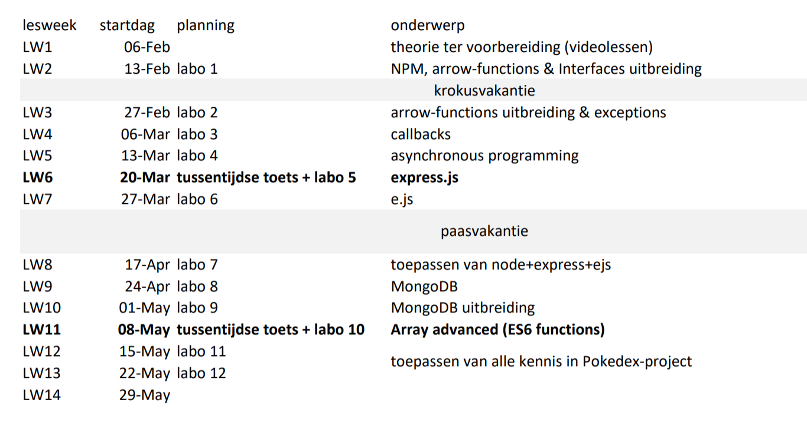

<style>
section {
  padding: 100px;
  background-image: url('background.png');
  background-size: cover;
}
h1 {
    color: rgb(153,35,36)
}
</style>
# Webontwikkeling
<style scoped>
section {
  padding-left: 400px;
  color: white;
}
h1 {
  font-size: 60px;
  color: white;
}
a {
  color: white ;
}
h3 {
  font-size: 40px;
  color: white
}
</style>


### Labo 1
Introductie
graduaat 1PROG

---
# Voorkennis

- **Webprogrammeren**
- Webtechnologie
- **Niet geslaagd?** 
  - Er wordt geen leerstof van Semester 1 opnieuw herhaald.

---
# Wat gaan we doen?

- Uitbreiding van kennis TypeScript
- Bouwen van een webapplicatie gebruikmakend van Express/NodeJS/EJS
- Gebruik maken van een database (MongoDB)

--- 
# Evaluatie

- **Permanente Evaluatie**: 50%
- **Examen**: 50%

--- 
# Permanente evaluatie
- Twee tussentijdse evaluaties (LW6 en LW11)
- Git repository (wekelijks commit+push)

---
# Agenda



---
# Theorie

- Geen aparte theorielessen
- **Zelfstandig** bekijken van het bestaande videomateriaal.
- Herhaling tijdens het labo. Niet alles wordt terug opnieuw uitgelegd.
- **Vragen stellen tijdens het labo**

--- 

# Labo

- **Zelfstandig** werken aan de opdrachten.
- Hulp medestudenten mag, maar **niet** volledige oplossingen uitwisselen.
- Is er iets niet duidelijk: **vragen stellen**!
- PRO oefeningen bevatten extra uitdagingen. 
  - Geen leerstof voor het examen.
- Elke les alles toevoegen aan je git repository. (commit + push)

--- 
---
<style>
section {
  padding: 100px;
  background-image: url('background.png');
  background-size: cover;
}
h1 {
    color: rgb(153,35,36)
}
</style>
# Webontwikkeling
<style scoped>
section {
  padding-left: 400px;
  color: white;
}
h1 {
  font-size: 60px;
  color: white;
}
a {
  color: white ;
}
h3 {
  font-size: 40px;
  color: white
}
</style>


### Labo 1
NPM / Arrow functions / Interfaces
graduaat 1PROG

---

# NPM
- Node Package Manager
- Installeren van externe packages
- https://www.npmjs.com/

---

# Project initialiseren

Elk labo starten we met het initialiseren van een nieuw project. 

```
npm init
tsc --init
npm install --save-dev @types/node
npm install <package>
...
```
---

# node_modules

- Alle packages die je installeert worden in de map `node_modules` geplaatst.
- Deze map wordt niet meegecommit in je git repository. (toevoegen aan .gitignore)
- Nooit inzenden bij je opdracht!

---

# NPM packages

- https://www.npmjs.com/package/sloth-log
- https://www.npmjs.com/package/cat-me
- https://www.npmjs.com/package/readline-sync
- https://www.npmjs.com/package/rainbow-colors-array-ts
- https://www.npmjs.com/package/chalk
- ...

---

# Require / import

- Om een package te gebruiken in je code moet je deze eerst importeren.
- Dit doe je met de `require` of `import` statement.

  ```typescript
  // require
  const chalk = require('chalk');

  // import
  import chalk from 'chalk';
  ```
- Voorlopig gebruiken we enkel de `require` statement in labo's (tot express). Je mag wel al `import` gebruiken.
---

# Arrow functions

- Arrow functions zijn een alternatief voor de `function` statement.
- Ze zijn korter en worden vaak gebruikt in combinatie met callbacks.

  ```typescript
  // function statement
  function add(a: number, b: number): number {
    return a + b;
  }

  // arrow function
  const add = (a: number, b: number): number => { return  a + b };
  ```

---

# Arrow functions (2)

- Kortere versie van een arrow function:

  ```typescript
  // arrow function
  const add = (a: number, b: number): number => { return  a + b };

  // kortere versie
  const add = (a: number, b: number): number => a + b;
  ```

---

# Optional parameters

- We kunnen parameters optioneel maken door een `?` toe te voegen.

  ```typescript
  const add = (a: number, b?: number): number => {
    if (b) {
      return a + b;
    } else {
      return a;
    }
  }

  add(5)
  ```

---

# Default parameters

- We kunnen een default waarde toekennen aan een parameter.

  ```typescript
  const add = (a: number, b: number = 0): number => {
    return a + b;
  }
  ```

---

# Interfaces

- Interfaces zijn een manier om een object te beschrijven.
- We kunnen een interface gebruiken om een object te valideren.

  ```typescript
  interface Person {
    name: string;
    age: number;
  }

  const person: Person = {
    name: 'John',
    age: 25
  }
  ```

---

# Interfaces (2)

- Maar interfaces kan je ook gebruiken om functies te beschrijven.

  ```typescript
  interface Operatie {
    (a: number, b: number): number;
  }

  const add: Operatie = (a, b) => {
    return a + b;
  }

  const minus: Operatie = (a, b) => {
    return a - b;
  }
  ```
- Nut van interfaces bij functies wordt duidelijk bij callbacks.

---

# Herhalingsoefening

- https://www.typescriptlang.org/play
- Maak een functie `repeatWord` die een bepaald woord een aantal keer herhaalt en afprint. Je mag nog `function` gebruiken.
- De functie heeft 3 parameters:
  - `word`: het woord dat herhaald moet worden.
  - `times`: het aantal keer dat het woord herhaald moet worden.
  - `delimiter`: het teken dat gebruikt wordt om de woorden te scheiden. 

  ```
  repeatWord("hello", 3, "-");
  // hello-hello-hello
  ```

  ```
  repeatWord("hello", 2, " ");
  // hello hello hello
  ```

---